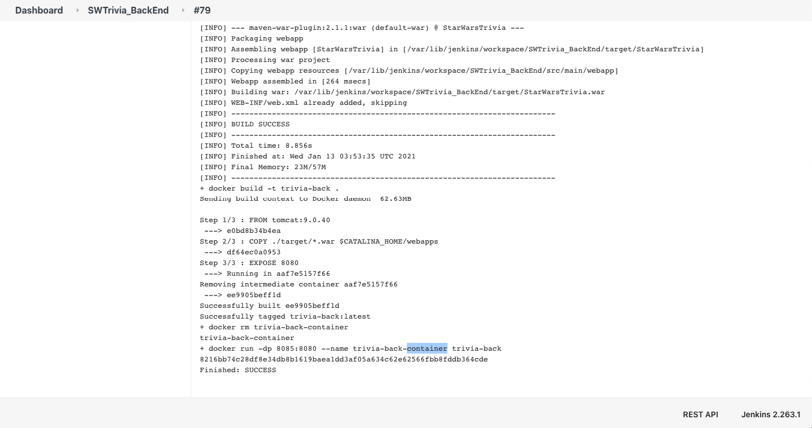

# Star Wars Trivia Back End

## Project Description
In this web based trivia game, players are asked questions about different Star Wars topics and they must get as many correct answers as possible. Success is incentivized by potential to earn rewards. Players can register and sign up to participate in the leader board and character showcase. Players are issued character elements to premiere in their showcase, gain additional options as they play the game.

## Technologies Used
* Java 8
* Spring Tool Suite 4
* Maven
* Spring MVC
* Hibernate
* Log4J2
* JUnit
* Postman
* PostgreSQL
* DBeaver
* Git
* AWS
	* EC2
	* AMI
	* EBS
	* Security Group
	* RDS
* Jenkins
* Docker

## Features
**Ready Features**
* Login
* Registration
* Insert User Score
* Get Template Question
* Insert Reward Character
* Get User's Showcase
* Logout

**To-do List of Improvements**
* Add the ability for users to switch out characters in their showcase with characters in their list of reward characters
* Establish a successful connection to back end running on EC2
	* While a containerized project was successfully spun up in a Jenkins CI/CD pipeline on an EC2, we were unable to get any response from it other than a 404 response code.

* Add more unit tests
* Add the necessary back end logic for creating a chat board in the front end
* Add a system for trading cards
* Reward tokens to users, which they can use to 'buy' hints during trivia games

## Getting Started
* git clone https://github.com/bntufte/sw_back.git
* git pull
* Open the project in Spring Tool Suite 4 or equivalent. Perform a Maven Update Project to acquire all the necessary dependencies
* Change the database URL in applicationContext.xml along with the username and password values

## Usage
* In IDE, right click project > RUN AS > RUN AS SERVER
* Launch the Angular server, following the necessary steps specified in that [Git Repository](https://github.com/bntufte/sw_front)

## Contributors
* [Brandon Tufte](https://github.com/bntufte)
* [Lew Griffith](https://github.com/logriffith)
* [John L. Rios Jr.](https://github.com/jlrjr98)
* [Skyler Tesar](https://github.com/skytsar)